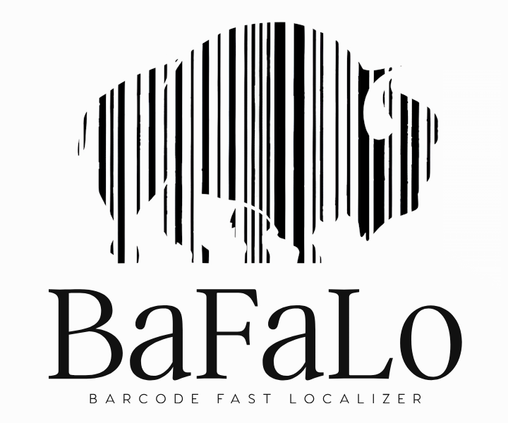

# BaFaLo: Barcode Fast Localizer

 

> **Official implementation of the CAIP 2025 paper "A Deep-Learning-Based Method for Real-Time Barcode Segmentation on Edge CPUs".**

**BaFaLo (Barcode Fast Localizer)** is an ultra-lightweight neural network for barcode localization and segmentation. It is specifically designed and optimized for real-time performance on low-power edge CPUs, eliminating the need for dedicated hardware accelerators. The model features a two-branch architecture with a local feature extractor and a global context module, tailored for low-resolution inputs to maximize inference speed while maintaining high accuracy for both 1D and 2D barcodes.

## 🏛️ Architecture

The model is inspired by Fast-SCNN but is heavily streamlined for our use case. It consists of four main modules: a Learning to Downsample module, a Coarse Feature Extractor, a Feature Fusion module, and a Classifier that uses a pixel shuffle operation for high-quality upsampling.

## ✨ Key Features

- **Ultra-Lightweight:** Designed specifically for real-time performance on low-power edge CPUs without dedicated accelerators.
- **High Speed:** Achieves an inference time of just **57.62 ms** on a single core of a Raspberry Pi 3B+, approximately 9x faster than YOLO Nano.
- **Accurate:** Maintains a high decoding rate, nearly on par with YOLO Nano for 1D barcodes and only 3.5 percentage points lower for 2D barcodes, despite being significantly faster.
- **Segmentation-Based:** Employs a segmentation architecture that is robust to scale variations and does not rely on anchor boxes.
- **End-to-End Pipeline:** The repository provides the full pipeline for training, evaluation, and benchmarking.

## 📜 Citing our Work

If you find BaFaLo useful in your research, please consider citing our paper:

### BibTeX
```bibtex
@inproceedings{vezzali2025deep,
  title={A Deep-Learning-Based Method for Real-Time Barcode Segmentation on Edge CPUs},
  author={Vezzali, Enrico and Vorabbi, Lorenzo and Grana, Costantino and Bolelli, Federico and others},
  booktitle={Proceedings of the 21st International Conference in Computer Analysis of Images and Patterns},
  year={2025}
}
```
