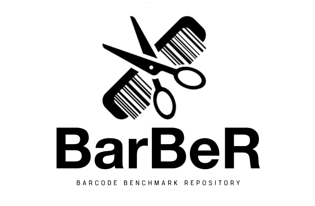
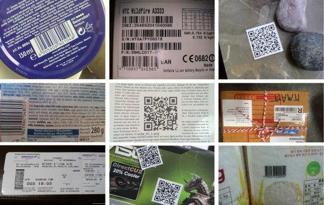

# BarBeR: Barcode Benchmark Repository
The repository contains multiple algorithms for 1D and 2D barcode localization proposed in different papers in the past years. The repository contains the tools to measure the performance of those algorithms




# Installation Instructions
To build the libraries you first need to install:
- OpenCV for C++ (v4) and OpenCV-contrib (Instructions [here](https://docs.opencv.org/4.x/d7/d9f/tutorial_linux_install.html)) 
- Install Boost with the following command: sudo apt -y install libboost-filesystem-dev (ubuntu). For windows, follow [these instructions](https://robots.uc3m.es/installation-guides/install-boost.html#install-boost-ubuntu).

Then, you can build the repository using CMake:
```
mkdir build
cd build
cmake ..
cmake --build .
```
To install all required Python libraries run this command:
```
pip install -r requirements.txt
```

# Download the Dataset
The dataset can be downloaded from this [Link](https://unimore365-my.sharepoint.com/:f:/g/personal/319554_unimore_it/EpO-JIoN9HlJlvLBB4cZhREBTTiScfGMg6t1s68ifrtHMQ?e=gRHz0T).
Once Unzipped, you will find 2 folders inside: "Annotations" and "dataset". If you place these two folders directly inside the BarBeR folder there is no need to change the paths of the configuration files.



# Saved Models
One Saved Model for every architecture and scale can be downloaded from [here](https://1drv.ms/f/s!AhGbwgwB_qwFgbA0hLye0PkUnmYkVA?e=JMAX5e). Unzip the folder and place "Saved Models" directly inside the main repository folder.

# Compatibility
The repository has been developed with Linux as the main target OS. However, it should be possible to build the project also on Windows. The code is not architecture-specific and it's possible to build and run all the tests on different architectures. Both x86-64 and ARM architectures have been tested without any reported issues.

# Folders
* **algorithms**: Contains a Python class for every localization algorithm available. In particular, the available classes are:
  - detectron2_detector.py: loads a Detectron2 model in .pt or .pth format and uses it for localization.
  - gallo_detector.py: runs the 1D barcode localization method proposed by Orazio Gallo and Roberto Manduchi in the 2011 paper ["Reading 1D Barcodes with Mobile Phones Using Deformable Templates"](https://pubmed.ncbi.nlm.nih.gov/21173448/).
  - pytorch_detector.py: loads a Pytorch detection model in .pt or .pth format and uses it for localization.
  - soros_detector.py: runs the 1D and 2D barcode localization method proposed by G. Sörös and C. Flörkemeier in the 2013 paper [Blur-resistant joint 1D and 2D barcode localization for smartphones](https://dl.acm.org/doi/10.1145/2541831.2541844).
  - tekin_detector.py: runs the 1D barcode localization method proposed by E. Tekin et al. in the 2013 paper ["S-K Smartphone Barcode Reader for the Blind"](https://www.ncbi.nlm.nih.gov/pmc/articles/PMC4288446/).
  - ultralytics_detector.py: loads an Ultralytics model (YOLO or RT-DETR supported) in .pt or .pth format and uses it for localization
  - yun_detector.py: runs the 1D barcode localization method proposed by I. Yun and K. Joongkyu in the 2017 paper ["Vision-based 1D barcode localization method for scale and rotation invariant"](https://ieeexplore.ieee.org/abstract/document/8228227).
  - zamberletti_detector.py: runs the 1D barcode localization method proposed by A. Zamberletti et al. in the 2013 paper ["Robust Angle Invariant 1D Barcode Detection"](http://artelab.dista.uninsubria.it/res/research/papers/2013/2013_zamberletti_acpr.pdf).
  - zharkov_detector.py: uses the deep-learning architecture proposed by A. Zharkov and I. Zagaynov in the 2019 paper ["Universal Barcode Detector via Semantic Segmentation"](https://arxiv.org/abs/1906.06281). The model must be a Pytorch model. The class can be used for both 1D and 2D barcode detection.
* **config**: contains the .yaml configuration files for each Python script that needs a configuration file. These configuration files are examples and can be modified depending on the configuration needed.
* **python**: contains all Python files, including all test scripts. In particular:
  - test_single_class.py: runs a set of detection algorithms on the test set considering only barcodes of one class i.e. 1D or 2D. The test measures precision, recall, F1-scores, mAP0.5, and mAP[0.5:0.95] of all methods.
  - test_multi_class.py: runs a set of detection algorithms on the test set considering all images. The test measures precision, recall, F1-scores, mAP0.5, and mAP[0.5:0.95] of all methods.
  - time_benchmark.py: runs a set of detection algorithms on the test set (or part of it) and measures the mean processing times of all methods.

* **scripts**: contains bash scripts to run pipelines of Python files (useful for k-fold cross-validation)
* **results**: contains the results produced by running the tests. Results are divided into 2 categories:
  - reports: are .yaml files generated after running a Python test
  - graphs: are .png files representing a graph generated using one or multiple .yaml reports
 
All other folders are needed to compile the necessary libraries when building the repository.
 
# Generate Train-Test Split Annotations
For a test we need COCO annotations divided into train.json, val.json, and test.json. To configure how to split the annotations, we use a configuration file. An example is ```config/generate_coco_annotations_config.yaml```. With the configuration file, we can select which files to use and which annotations, the train-test split size, and if we are using K-fold cross-validation.
The script used to generate the annotation is ```python/generate_coco_annotations.py```, which takes as input a configuration file and optionally the index k, which indicates the index of the current cross-validation test.

```
python3 python/generate_coco_annotations.py -c ./config/generate_coco_annotations_config.yaml  -k 0
```

If we also need to train an Ultralytics model, we need YOLO annotations, which will be generated with the following command:

```
python3 python/convert_coco_to_yolo.py -c ./annotations/COCO/ -o "./dataset/
```

# Test Single-Class Detection Test
The Python script that runs the Single-Class detection test is ```test_single_class.py```. The inputs are a configuration file and a path to the result report destination. In this repository, there are three working examples of configuration files, one for single-ROI 1D barcode detection (```./config/test1D_singleROI.yaml```), one for multi-ROI 1D barcode detection (```./config/test1D_multiROI.yaml```), and one for single-ROI 2D barcode detection (```./config/test1D_singleROI.yaml```).

# Multi-Class Detection Test
The Python script that runs the Single-Class detection test is ```test_multi_class.py```. The inputs are a configuration file and a path to the result report destination. In this repository, there is one working configuration file for multi-class detection (```./config/test_multiclass.yaml```)

Example multi-class detection Test:
```
python3 python/test_multi_class.py -c "./config/test_multiclass.yaml" -o "./results/reports/test_multiclass_640_0"
```

# Time Benchmark
The Time Benchmark is used to measure the processing time of different localization methods. In this case, the test runs on all images of the dataset, comprising the training set, validation set, and test set.
The script to perform a timing test is ```time_benchmark.py``` and the required inputs are a path to a configuration file and a path to the destination folder for the generated report. A configuration file example is ```config/timing_config.yaml```. 

Example Timing Benchmark:
```
python3 python/time_benchmark.py -c "./config/timing_config.yaml" -o "./results/reports/test_time_640_0"
```

# Draw Graphs from the results
To generate a graph from the results generated by a Single-Class Detection Test run ```python3 python/visualizer/single_class_graphs.py```.
To generate a graph from the results generated by a Multi-Class Detection Test run ```python3 python/visualizer/multi_class_graphs.py```.

To change the path of the input reports, change the variable 'base_path' present in both scripts. In the case of a single class detection test, it's necessary to select the right barcode type changing the variable type, which could be '1D' or '2D'. Graphs will be generated in the folder ```results/graphs```.

# Train a deep-learning model
To train a model with Ultralytics run ```python/ultralytics_trainer.py```. A configuration file is needed (e.g. ```config/ultralytics_training_config.yaml```), as well as an output path for the trained model (Default is Saved Models).
</br></br>
To train a model with Detectron2 run ```python/detectron2_trainer.py```. A configuration file is needed (e.g. ```config/detectron2_training_config.yaml```), as well as an output path for the trained model (Default is Saved Models).
</br></br>
To train a Zharkov model run ```Zharkov2019/zharkov_trainer.py```. A configuration file is needed (e.g. ```config/zharkov_training_config.yaml```), as well as an output path for the trained model (Default is Saved Models).

# K-fold cross-validation
To run K-fold cross-validation, it would be necessary to run the scripts multiple times manually. Since running the scripts multiple times and changing the configuration each time would take too much time, it is possible to automate the process using a bash script. The python file ```python/create_configuration_yaml.py``` is used to generate a new configuration each time, so, to change the settings of a K-fold cross-validation test the file ```python/create_configuration_yaml.py``` must be changed accordingly. Scripts can be used also to train multiple networks, each with a different test set.

Example train 5 Ultralytics networks:
```
source scripts/k_fold_training_ult.sh
```

Example train 5 Detectron2 networks:
```
source scripts/k_fold_training_det.sh
```

Example run 5 single-class tests with 1D barcodes:
```
source scripts/k_fold_test_1D_singleROI.sh
```

Example run 5 multi-class tests:
```
source scripts/k_fold_test_multiclass.sh
```

# Testing a New Localization Algorithm
* The localization method must be defined inside a new python file (e.g. ```new_algorithm.py```) and the file must be placed inside the ```algorithms``` folder
* Define a class with the implementation of the algorithm. To ensure compatibility, the new class should inherit from the abstract class "BaseDetector" defined in ```algorithms/detectors_abs.py```
* A detector must have at least these two methods: detect and get_timing
* **detect works** on a single image and outputs a list of detected bounding boxes, a list with the classes of the detections, and a list of confidence scores (between 0 and 1 if available, otherwise None)
* **get_timing** returns the processing time of the last detection in milliseconds. The use of ```perf_counter_ns``` is advised, because it has a [high resolution](https://peps.python.org/pep-0564/#annex-clocks-resolution-in-python) (around 100ns) on both Linux and Windows. The output of ```perf_counter_ns``` should then be divided by 1e6.
  
 ```python
# Defining the new class inside algorithms/new_algorithm.py
from detectors_abs import BaseDetector

class NewDetector(BaseDetector):
  def __init__():
    ...
  def detect(self, img):
    ...
  def get_timing(self):
    ...
```

* To enable the new algorithm in a test, it should be added to the algorithms list in the configuration file used in the test. Check the available configuration files in the Repository for the exact syntax required
